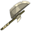
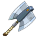
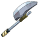
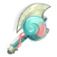
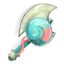
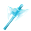
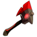
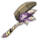
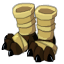
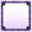

# Wakfu Quick Preview

Generated: 2026-03-17 09:05:17

## Item Icons (sample)

<table><tr>
<td align="center" style="padding:8px;"> <code>0000000</code></td>
<td align="center" style="padding:8px;"> <code>1010245</code></td>
<td align="center" style="padding:8px;"> <code>1010279</code></td>
<td align="center" style="padding:8px;"> <code>10110262</code></td>
<td align="center" style="padding:8px;"> <code>1011084</code></td>
</tr></table>
<table><tr>
<td align="center" style="padding:8px;"> <code>10111084</code></td>
<td align="center" style="padding:8px;"> <code>10112192</code></td>
<td align="center" style="padding:8px;"> <code>10112258</code></td>
<td align="center" style="padding:8px;"> <code>10112358</code></td>
<td align="center" style="padding:8px;"> <code>10112360</code></td>
</tr></table>

## Tooltip Texture Preview (Rendered)

These are actual tooltip/rarity textures downloaded from the official theme CDN and converted when needed.

| preview | id | source path | status |
|---|---|---|---|
|  | commonRarityBorder | theme/images/itemsRarityBorders/common.tga | ok (local:common.png) |
|  | epicRarityBorder | theme/images/itemsRarityBorders/epic.tga | ok (local:epic.png) |
|  | legendaryRarityBorder | theme/images/itemsRarityBorders/legendary.tga | ok (local:legendary.png) |
|  | mythicRarityBorder | theme/images/itemsRarityBorders/mythic.tga | ok (local:mythic.png) |
|  | oldRarityBorder | theme/images/itemsRarityBorders/old.tga | ok (local:old.png) |
|  | rareRarityBorder | theme/images/itemsRarityBorders/rare.tga | ok (local:rare.png) |
|  | relicRarityBorder | theme/images/itemsRarityBorders/relic.tga | ok (local:relic.png) |
|  | souvenirRarityBorder | theme/images/itemsRarityBorders/souvenir.tga | ok (local:souvenir.png) |
| (failed) | txAdminRarityBorder | theme/images/pictos/RarityBorder-Admin.tga | error: HTTP Error 403: Forbidden |
| (failed) | txCommonRarityBorder | theme/images/pictos/RarityBorder-Common.tga | error: HTTP Error 403: Forbidden |
| (failed) | txEpicRarityBorder | theme/images/pictos/RarityBorder-Epic.tga | error: HTTP Error 403: Forbidden |
| (failed) | txItemTooltipBGHeroes | theme/images/textures/TooltipBG-Heroes.tga | error: HTTP Error 403: Forbidden |

## Item Tooltip Cards (Theme-Based Preview)

This preview recreates item tooltip cards from official theme metadata (rarity + tooltip colors), even when CDN textures are blocked.

common tooltip

Objet de test

PA +1 | PM +1 | Maîtrise +120

rare tooltip

Objet de test

PA +1 | PM +1 | Maîtrise +120

epic tooltip

Objet de test

PA +1 | PM +1 | Maîtrise +120

legendary tooltip

Objet de test

PA +1 | PM +1 | Maîtrise +120

mythic tooltip

Objet de test

PA +1 | PM +1 | Maîtrise +120

relic tooltip

Objet de test

PA +1 | PM +1 | Maîtrise +120

souvenir tooltip

Objet de test

PA +1 | PM +1 | Maîtrise +120

## Tooltip/Item Theme References

These are key references in the official theme likely involved in item tooltip rendering.

| id | path | usage |
|---|---|---|
| commonRarityBorder | theme/images/itemsRarityBorders/common.tga |  |
| epicRarityBorder | theme/images/itemsRarityBorders/epic.tga |  |
| legendaryRarityBorder | theme/images/itemsRarityBorders/legendary.tga |  |
| mythicRarityBorder | theme/images/itemsRarityBorders/mythic.tga |  |
| oldRarityBorder | theme/images/itemsRarityBorders/old.tga |  |
| rareRarityBorder | theme/images/itemsRarityBorders/rare.tga |  |
| relicRarityBorder | theme/images/itemsRarityBorders/relic.tga |  |
| souvenirRarityBorder | theme/images/itemsRarityBorders/souvenir.tga |  |
| txAdminRarityBorder | theme/images/pictos/RarityBorder-Admin.tga |  |
| txCommonRarityBorder | theme/images/pictos/RarityBorder-Common.tga |  |
| txEpicRarityBorder | theme/images/pictos/RarityBorder-Epic.tga |  |
| txItemTooltipBGHeroes | theme/images/textures/TooltipBG-Heroes.tga |  |
| txItemTooltipBGOver | theme/images/textures/TooltipBG-Over.tga |  |
| txItemTooltipBGPinned | theme/images/textures/TooltipBG-Default.tga |  |
| txItemTooltipBorderAdmin | theme/images/textures/Tooltip-Borders-Admin.tga |  |
| txItemTooltipBorderCommon | theme/images/textures/Tooltip-Borders-Common.tga |  |
| txItemTooltipBorderEpic | theme/images/textures/Tooltip-Borders-Epic.tga |  |
| txItemTooltipBorderLegendary | theme/images/textures/Tooltip-Borders-Legendary.tga |  |
| txItemTooltipBorderMemory | theme/images/textures/Tooltip-Borders-Memory.tga |  |
| txItemTooltipBorderMythic | theme/images/textures/Tooltip-Borders-Mythic.tga |  |
| txItemTooltipBorderOld | theme/images/textures/Tooltip-Borders-Old.tga |  |
| txItemTooltipBorderRare | theme/images/textures/Tooltip-Borders-Rare.tga |  |
| txItemTooltipBorderRelic | theme/images/textures/Tooltip-Borders-Relic.tga |  |
| txItemTooltipGradient | theme/images/textures/Tooltip-Gradient.tga |  |
| txLegendaryRarityBorder | theme/images/pictos/RarityBorder-Legendary.tga |  |
| txMythicRarityBorder | theme/images/pictos/RarityBorder-Mythic.tga |  |
| txNPLabelItemRarity | theme/images/textures/NP-ItemRarity.tga |  |
| txNegativeBorder | theme/images/pictos/RarityBorder-Negative.tga |  |
| txOldRarityBorder | theme/images/pictos/RarityBorder-Old.tga |  |
| txPositiveBorder | theme/images/pictos/RarityBorder-Positive.tga |  |
| txRareRarityBorder | theme/images/pictos/RarityBorder-Rare.tga |  |
| txRelicRarityBorder | theme/images/pictos/RarityBorder-Relic.tga |  |
| txSelectorBorder | theme/images/textures/Tooltip-Borders-Selector.tga |  |
| txSouvenirRarityBorder | theme/images/pictos/RarityBorder-Memory.tga |  |
| txSpellTooltipBorder | theme/images/textures/Tooltip-Borders-Spell.tga |  |
| txUnidentifiedItem | theme/images/pictos/Stuff-Question.tga |  |
| unidentifiedItem | theme/images/unidentifiedItem.tga |  |

## Useful Paths

- Item icons folder: ../data/ankama_official/wakassets/items/
- Theme source: ../data/ankama_official/theme/theme.json

